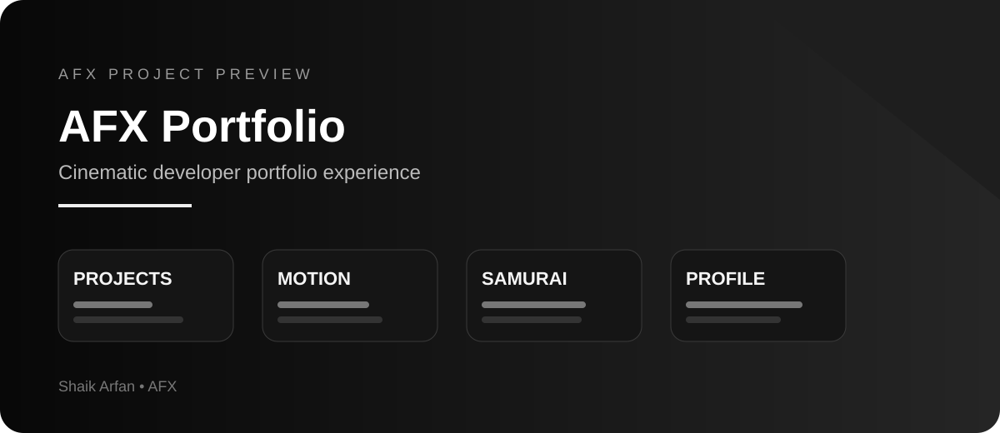
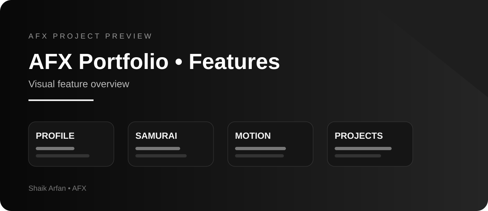

<p align="center">
  
</p>

<p align="center">
  
</p>

# SHAIK ARFAN — AFX Portfolio 2026

A cinematic, responsive portfolio for Shaik Arfan: AI developer, LLM developer, UI/UX designer and frontend developer.

## Run locally

Requires Node.js 22.13 or newer. Install with the package manager pinned in package.json:

```bash
corepack enable
pnpm install --frozen-lockfile
pnpm dev:next
```

Open the local address printed by Next.js. `pnpm dev` runs the alternative Vinext preview used by the hosted version.

## Production builds

```bash
pnpm lint
pnpm typecheck
pnpm build:next
pnpm start:next
```

The project uses standard Next.js App Router source. The hosted edition uses the included Vinext/Vite adapter and Cloudflare-compatible build (`pnpm build`). Both compile the same app and data files. Run one development/build mode at a time per checkout; the frameworks share generated type output. Keep the pnpm lockfile authoritative. `npm run lint` and `npm run build` can also invoke the scripts after dependency installation.

## Included

- Full viewport entry on every visit, with progress tied to portrait/artwork decoding and critical fonts. The displayed count interpolates smoothly over 1.8 seconds of animation, never exceeding actual readiness; there is no added loading hold. The red circle is removed.
- Original uploaded photographs, locally optimized to WebP. No generated face or stock person.
- Large editorial hero, pointer-reactive photograph and opposite-moving marquees.
- Move over the right side of the opening portrait to reveal the samurai; move left to restore Arfan. Tap to switch on touch devices, or use left/right arrow keys while the portrait control is focused. The portrait and background grid have subtle scroll parallax alongside the rotating, sheathing katana and scrolling duel.
- Manifesto, portrait reveal with keyboard/touch control, tabbed skills and process accordion.
- Eight selected projects, eight `/work/[slug]` pages, next-project navigation and a custom 404.
- Project-derived build log, interactive education timeline, Canvas Neural Core and contact links.
- GSAP/ScrollTrigger, Lenis, desktop cursor, reduced-motion support and mobile-specific composition.
- Dialog focus trapping, Escape-to-close navigation, labelled controls, visible focus and semantic headings.
- SEO metadata, project metadata, Person JSON-LD, sitemap, robots and a custom favicon.

## Content configuration

- `data/profile.ts`: name, education, roles and photograph paths.
- `data/socials.ts`: user-supplied email, LinkedIn and GitHub destinations.
- `data/skills.ts`: disciplines and process stages.
- `data/projects.ts`: project descriptions, notes, repository links and image paths.
- `data/site.ts`: canonical site origin; change for a custom domain or a different host.
- `app/globals.css`: shared design tokens, typography, composition and responsive behavior.
- `components/afx/`: portfolio components and interaction systems.

## Photographs

`public/images/arfan/gym.webp` derives from the supplied `me 2.jpeg`. `motorcycle.webp` derives from `me.jpeg`. These replace all previously used photographs. Only orientation, resizing and WebP compression are applied to the source files. Visual cropping, grayscale, masking and lighting are reversible CSS. Facial identity is preserved.

The sword and armored samurai are original generated artwork in `public/images/samurai/`. They are separate decorative assets; neither portrait was generated or altered. The samurai direction follows the user’s latest revision. The entrance animates the katana across a crimson slash, and the hero provides a Replay Sword button. Scrolling rotates the background katana and moves its matching scabbard over the blade; scrolling further draws it again. A sixteen-pose samurai kata follows your scroll in the manifesto, with adjacent poses dissolving smoothly. Selected work contains a five-shot cinematic sequence: an armored close-up, the approach, a sword clash, a decisive strike and the aftermath. Each shot has its own camera pan and zoom. Soft dissolves, feathered scene edges, a foreground katana sweep and brief clash sparks follow scroll progress. The heading stays in place and the sequence reverses when scrolling backward. Every project also ends with its own scroll-controlled katana transition: the blade slides into a stationary cover, pauses fully sheathed, then draws out again. The existing sword and cover images use fitted SVG clipping contours instead of blend modes, removing their rectangular black canvas while keeping the dark grip solid. A scroll-driven light glides over the steel as the assembly tilts, with a subtle red glow behind it. Their collar alignment and blade mask follow the source artwork; the full drawn assembly scales to fit phone screens. There is no continuous duel loop. Reduced motion uses static artwork. Typography is intentionally smaller after the user’s latest revision.

## Project imagery and claims

Real project screenshots were not supplied in the current brief. All eight fallback previews are clearly labelled **INTERFACE CONCEPT** and are rendered as code-native interface studies, not represented as genuine screenshots. Put replacement media in `public/projects/<slug>/` and update `cover`/`gallery` in `data/projects.ts`.

Descriptions originate from the user's brief. Detailed project notes expand those descriptions as intentions, without invented client work, awards, usage numbers or performance results. Only the three repository URLs supplied in conversation are attached; other projects link to their own project notes and contact. The current PC Optimizer repository path came from the user's latest repository conversation. External repository availability could not be checked in the build environment.

## Accessibility and performance

The cursor is supplementary and disabled on touch devices. Native pointer behavior remains available. The Neural Core pauses outside the viewport and when the tab is hidden, and renders a static state for reduced motion. Pointer motion never rotates the user's face. Core photographs and fonts are served locally, avoiding third-party runtime asset dependencies. Sound is intentionally omitted (optional in the brief); there is no autoplay audio.

The design targets smooth animation on capable devices; 60 FPS is not a universal guarantee. See `QA.md` for actual checks and any limitations.

## Deployment

The hosted project keeps its identity in `.openai/hosting.json`. Do not copy that identity to a different Site. Standard Next.js deployment can use `pnpm build:next` and `pnpm start:next`. The Sites version uses `pnpm build` and the generated Worker/static output.

## Credits

Reference studied: https://mina-massoud.com/ — pacing, scale, chapter structure and interactions only. No source code, photographs, personal copy, logos or artwork from that site are included. Portrait photography supplied by the user. Typography: Space Grotesk and IBM Plex Mono. Icons: Lucide. Fonts are distributed through their licensed Fontsource packages.
